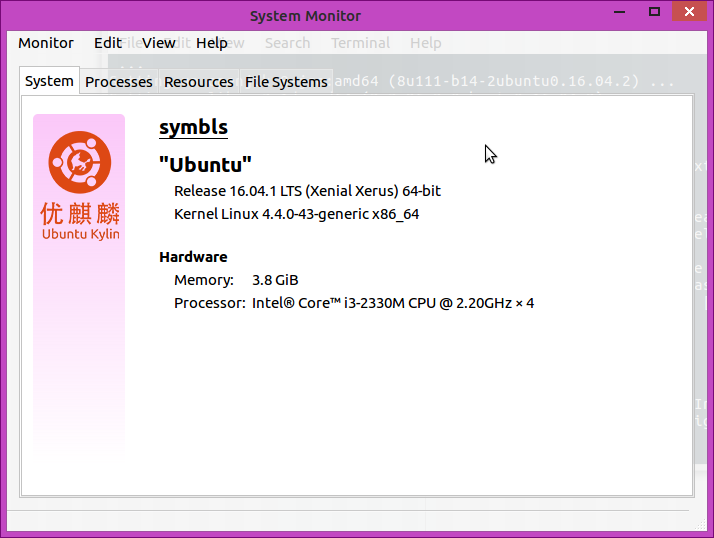

# Environment and Software Used

## Environment

+	Release 16.04.1 LTS (Xenial Xerus) 64-bit Kernel Linux 4.4.0-43-generic x86_64

## Sofeware

+	[Intellij Idea](http://www.jetbrains.com/idea/)
+ [ATOM](https://atom.io/)
+ git
+ [Java SE Development Kit 8](http://www.oracle.com/technetwork/java/javase/downloads/jdk8-downloads-2133151.html)

## Others

+ Disk Image Writer that is contained in the system to make startup disk
+ yEd to draw the structure of sth.
